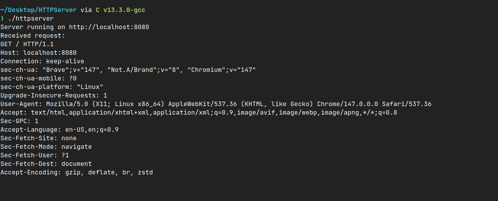
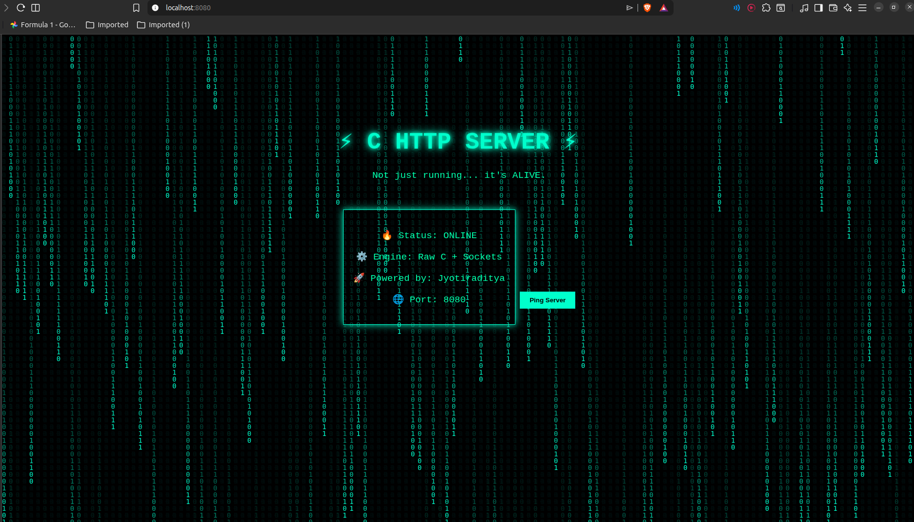

# ⚡ C HTTP Server

> A raw, dependency-free HTTP server built from scratch in C using POSIX sockets — serving real files over real TCP connections.



---

## 🖥️ Live Preview

> What you see when you open `http://localhost:8080` in your browser:



---

## 📖 Overview

This is a minimal HTTP/1.1 file server written entirely in C with no external libraries. It handles incoming TCP connections, parses HTTP GET requests, and serves static files from disk — just like a real web server, but built from the ground up.

```
Browser (GET /)
      │
      ▼
[ TCP Socket: port 8080 ]
      │
      ▼
[ Parse HTTP Request ]
      │
      ├── Method != GET  ──► 405 Method Not Allowed
      ├── Path has ".."  ──► 400 Bad Request
      ├── File not found ──► 404 Not Found
      │
      └── File found ────► 200 OK + file contents
```

---

## 📁 Project Structure

```
http-server/
│
├── httpserver.c     # Core server — socket, HTTP parsing, file serving
├── index.html       # Default page served at "/"
├── Makefile         # Build, run, and clean targets
└── screenshots/     # 📸 Add your screenshots here (see below)
    ├── server-running.png
    └── index-page.png
```

---

## ⚙️ How It Works

### 1. Socket Setup
Creates a TCP socket, binds to port `8080`, and listens for connections with a backlog of 10.

### 2. Request Parsing
For each client, reads the raw HTTP request and parses the **method**, **path**, and **HTTP version** using `sscanf`.

### 3. Security Checks
| Check | Response |
|-------|----------|
| Method is not `GET` | `405 Method Not Allowed` |
| Path contains `..` | `400 Bad Request` (blocks path traversal) |
| File doesn't exist | `404 Not Found` |

### 4. File Serving
Opens the requested file in binary mode, reads its size with `fseek`/`ftell`, sends the HTTP header, then streams the file in **1 KB chunks** — no full-file buffering.

---

## 🚀 Getting Started

### Prerequisites

- GCC compiler
- `make`
- Linux / macOS

### Build & Run

```bash
# Clone the repo
git clone https://github.com/your-username/http-server-c.git
cd http-server-c

# Build
make

# Run
./httpserver
```

Then open your browser and visit:

```
http://localhost:8080
```

### Makefile Targets

```bash
make          # Build the server
make run      # Build and run in one step
make clean    # Remove compiled binary
```

### Makefile

```makefile
CC = gcc
CFLAGS = -Wall -Wextra

all: httpserver

httpserver: httpserver.c
	$(CC) $(CFLAGS) httpserver.c -o httpserver

run: httpserver
	./httpserver

clean:
	rm -f httpserver
```


## 🔧 Configuration

| Parameter    | Value    | Location                          |
|--------------|----------|-----------------------------------|
| Port         | `8080`   | `httpserver.c` → `#define PORT`        |
| Buffer Size  | `4096 B` | `httpserver.c` → `#define BUFFER_SIZE` |
| Default File | `index.html` | `httpserver.c` → `handle_client()`|

To change the port, edit the `#define PORT 8080` line at the top of `httpserver.c`.

---

## ⚠️ Known Limitations

This is a learning project. These are intentional simplifications:

- **Single-threaded** — handles one request at a time; concurrent connections queue up
- **GET only** — POST, PUT, DELETE are rejected with `405`
- **Content-Type is hardcoded** — all files are served as `text/html` regardless of extension
- **No `SO_REUSEADDR`** — if the server crashes, you may need to wait ~60s before restarting on the same port
- **`file_size` uses `int`** — `ftell()` returns `long`; very large files could overflow

These make great next steps if you want to extend the project!

---

## 📚 Concepts Covered

- **Raw TCP sockets** — `socket()`, `bind()`, `listen()`, `accept()`
- **HTTP/1.1 protocol** — manually parsing request lines and building response headers
- **File I/O** — `fopen()`, `fseek()`, `ftell()`, `fread()`, chunked streaming
- **Basic security** — method whitelisting, path traversal prevention
- **Makefile** — automating build, run, and clean

---

## 📜 License

This project is open source and available under the [MIT License](LICENSE).

---

<p align="center">Built from scratch with C, sockets, and zero dependencies ⚡</p>
